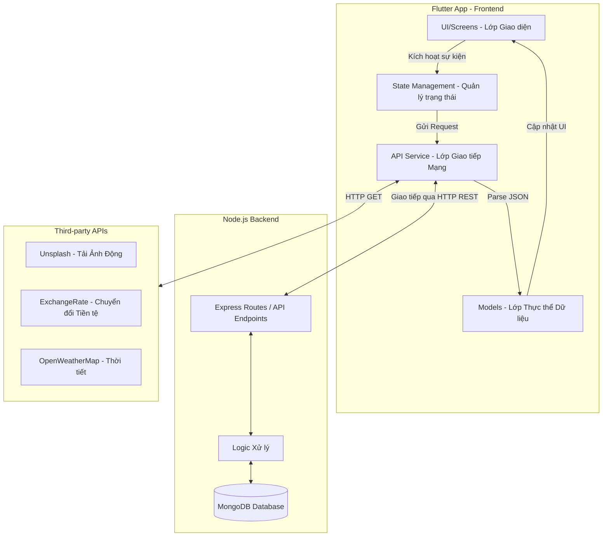

# BÁO CÁO ĐỒ ÁN MÔN LẬP TRÌNH DI ĐỘNG
**Tên dự án:** Ứng dụng Du lịch (Travel App)

---

## I. TỔNG QUAN KIẾN TRÚC ỨNG DỤNG (ARCHITECTURE)

Ứng dụng được xây dựng dựa trên mô hình **Client - Server** và áp dụng các nguyên lý của **Clean Architecture** trong Flutter, giúp mã nguồn dễ bảo trì, mở rộng và dễ đọc.

### 1. Sơ đồ kiến trúc tổng quát



### 2. Chi tiết các thành phần trong Flutter
- **UI/Screens (`lib/screens`):** Lớp hiển thị giao diện người dùng. Không chứa logic nghiệp vụ phức tạp hay logic gọi mạng. Dữ liệu hiển thị hoàn toàn thông qua các class Model.
- **Models (`lib/models`):** Bao gồm `UserModel`, `TourModel`, `TripModel`. Lớp này nhận dữ liệu JSON dạng Map từ API và sử dụng phương thức `fromJson()` để chuyển thành các đối tượng (Objects) thao tác được trong Dart.
- **API Service (`lib/services/api_service.dart`):** Nơi duy nhất chịu trách nhiệm giao tiếp với backend thông qua gói `http`. Áp dụng các Helper functions (`_safeGet`, `_safePost`) để gom nhóm và bắt lỗi mạng tập trung (Timeout, SocketException).

---

## II. DANH SÁCH 10 REST API TÍCH HỢP

Tất cả các API được host tại Base URL: `http://localhost:5000/api`

### 1. Đăng ký tài khoản (Register)
- **Endpoint:** `/auth/register`
- **Method:** `POST`
- **Mô tả:** Tạo tài khoản người dùng mới vào hệ thống. Mật khẩu được băm (hash) trước khi lưu vào MongoDB.
- **Request Body (JSON):**
  - `name` (String, required): Tên người dùng.
  - `email` (String, required): Địa chỉ email.
  - `password` (String, required): Mật khẩu (tối thiểu 6 ký tự).
- **Response Thành công (200 OK):**
  ```json
  {
    "success": true,
    "token": "eyJhbGciOiJIUzI1NiIsInR...",
    "user": {
      "id": "60d5ecb8b392d7",
      "name": "Nguyen Van A",
      "email": "nva@gmail.com"
    }
  }
  ```
- **Response Lỗi (400 Bad Request):**
  `{"success": false, "message": "Email đã tồn tại"}`

### 2. Đăng nhập (Login)
- **Endpoint:** `/auth/login`
- **Method:** `POST`
- **Mô tả:** Đăng nhập và nhận chuỗi JWT (JSON Web Token) dùng để xác thực các request sau này. Token được lưu vào `SharedPreferences` ở phía Flutter.
- **Request Body (JSON):**
  - `email` (String, required): Địa chỉ email.
  - `password` (String, required): Mật khẩu.
- **Response Thành công (200 OK):**
  ```json
  {
    "success": true,
    "token": "eyJhbGciOiJIUzI1NiIsInR...",
    "user": { "id": "...", "name": "...", "email": "..." }
  }
  ```

### 3. Lấy thông tin cá nhân (Get Profile)
- **Endpoint:** `/auth/profile`
- **Method:** `GET`
- **Headers:** `Authorization: Bearer <token>`
- **Mô tả:** API trả về thông tin cá nhân của người dùng hiện tại dựa trên Token cung cấp.
- **Response Thành công (200 OK):**
  ```json
  {
    "success": true,
    "user": {
      "id": "60d5ecb8b392d7",
      "name": "Nguyen Van A",
      "email": "nva@gmail.com",
      "phone": "0123456789",
      "avatar": "https://url.to/avatar.jpg"
    }
  }
  ```

### 4. Cập nhật thông tin cá nhân (Update Profile)
- **Endpoint:** `/auth/profile`
- **Method:** `PUT`
- **Headers:** `Authorization: Bearer <token>`
- **Mô tả:** Cập nhật thông tin bổ sung (số điện thoại, ảnh đại diện, tên).
- **Request Body (JSON):**
  ```json
  {
    "name": "Nguyen Van A Mới",
    "phone": "0987654321"
  }
  ```
- **Response Thành công (200 OK):**
  ```json
  {
    "success": true,
    "message": "Cập nhật thành công",
    "user": {...}
  }
  ```

### 5. Lấy danh sách Tour du lịch (Get Tours)
- **Endpoint:** `/tours`
- **Method:** `GET`
- **Query Params:** 
  - `category` (String, optional): Lọc theo danh mục (ví dụ: beach, mountain).
  - `minPrice`, `maxPrice` (Number, optional): Lọc theo khoảng giá.
  - `page` (Number, default: 1): Trang hiện tại.
  - `limit` (Number, default: 10): Số lượng hiển thị mỗi trang.
- **Mô tả:** Tải danh sách Tour, hỗ trợ tính năng lọc và phân trang (Pagination).
- **Response Thành công (200 OK):**
  ```json
  {
    "success": true,
    "total": 50,
    "tours": [
      {
        "_id": "t1",
        "title": "Da Nang - Ba Na Hills",
        "location": "Da Nang, VN",
        "price": 400,
        "rating": 4.8,
        "image": "https://url.com/image.jpg"
      }
    ]
  }
  ```

### 6. Xem chi tiết Tour (Get Tour by ID)
- **Endpoint:** `/tours/:id`
- **Method:** `GET`
- **Mô tả:** Lấy thông tin chi tiết (lịch trình, đánh giá, chi tiết giá) của 1 tour duy nhất.
- **Response Thành công (200 OK):**
  ```json
  {
    "success": true,
    "tour": {
      "_id": "t1",
      "title": "Da Nang - Ba Na Hills",
      "description": "Chi tiết tour...",
      "duration": "2 days 1 night",
      "category": "mountain"
    }
  }
  ```

### 7. Lấy danh sách chuyến đi của User (Get Trips)
- **Endpoint:** `/trips`
- **Method:** `GET`
- **Query Params:** 
  - `userId` (String, required): ID của người dùng.
  - `status` (String, optional): upcoming / ongoing / completed / wishlist.
- **Mô tả:** Lấy lịch sử chuyến đi của riêng người dùng để hiển thị tại tab "My Trips".
- **Response Thành công (200 OK):**
  ```json
  {
    "success": true,
    "trips": [
      {
        "_id": "tr1",
        "title": "Du lịch Hội An",
        "status": "upcoming",
        "price": 2000000,
        "startDate": "2026-05-20T00:00:00Z"
      }
    ]
  }
  ```

### 8. Tạo chuyến đi mới (Create Trip)
- **Endpoint:** `/trips`
- **Method:** `POST`
- **Mô tả:** Người dùng chủ động tạo lịch trình chuyến đi mới.
- **Request Body (JSON):**
  ```json
  {
    "userId": "60d5ecb8b392d7",
    "title": "Du lịch Hội An",
    "location": "Hoi An, Vietnam",
    "startDate": "2026-05-20T00:00:00Z",
    "endDate": "2026-05-22T00:00:00Z",
    "status": "upcoming",
    "notes": "Đi cùng gia đình",
    "price": 2000000
  }
  ```
- **Response Thành công (200 OK):**
  ```json
  {
    "success": true,
    "trip": { "_id": "tr1", "title": "Du lịch Hội An", "status": "upcoming" }
  }
  ```

### 9. Cập nhật trạng thái chuyến đi (Update Trip)
- **Endpoint:** `/trips/:id`
- **Method:** `PUT`
- **Mô tả:** Sửa thông tin chuyến đi, ví dụ chuyển đổi trạng thái từ `upcoming` sang `completed`.
- **Request Body (JSON):**
  ```json
  {
    "status": "completed",
    "notes": "Chuyến đi tuyệt vời!"
  }
  ```
- **Response Thành công (200 OK):**
  ```json
  {
    "success": true,
    "message": "Cập nhật thành công",
    "trip": {...}
  }
  ```

### 10. Xóa chuyến đi (Delete Trip)
- **Endpoint:** `/trips/:id`
- **Method:** `DELETE`
- **Mô tả:** Xóa một chuyến đi khi người dùng muốn hủy bỏ.
- **Response Thành công (200 OK):**
  ```json
  {
    "success": true,
    "message": "Đã xóa chuyến đi"
  }
  ```

---

## III. BONUS APIs TÍCH HỢP BÊN THỨ 3 (THIRD-PARTY)

Ngoài hệ thống Backend cục bộ, ứng dụng có giao tiếp với các hệ thống mở để tăng cường trải nghiệm người dùng:

1. **ExchangeRate API (Tỷ giá tiền tệ):** 
   - **Mục đích:** Hiển thị giá tour linh hoạt theo tỷ giá VNĐ/USD mới nhất.
   - **Cách thức:** Gọi trực tiếp `GET https://api.exchangerate-api.com/v4/latest/USD`, bóc tách trường `rates['VND']` và nhân với giá tiền mặc định của ứng dụng.
2. **Unsplash API (Hình ảnh thông minh):** 
   - **Mục đích:** Khi người dùng xem một Tour hoặc thêm một Trip mới, hệ thống tự động tải hình ảnh địa danh tương ứng thay vì dùng ảnh tĩnh.
   - **Cách thức:** Gọi `GET /api/unsplash?query=[location]` để trả về danh sách URL hình ảnh chất lượng cao.

---

## IV. KỸ THUẬT XỬ LÝ LỖI (EXCEPTION HANDLING) & BẢO MẬT

1. **Bắt lỗi Mạng (Networking Error):**
   Tất cả API call được bao bọc trong khối `try/catch`. Khi xảy ra lỗi rớt mạng hoặc máy chủ không phản hồi (`SocketException`, `TimeoutException`), hệ thống sẽ ném ngoại lệ rõ ràng và ứng dụng hiển thị `SnackBar` thông báo cho người dùng, đảm bảo UI không bị treo.
2. **Bảo mật (Security):**
   - Mật khẩu mã hóa phía Backend.
   - Flutter lưu trữ Token trong `SharedPreferences` và tự động gắn vào Header `Authorization` cho những Route cần định danh (như Update Profile, Create Trip). Nếu Token hết hạn hoặc không có, API sẽ trả về lỗi `401 Unauthorized`.
